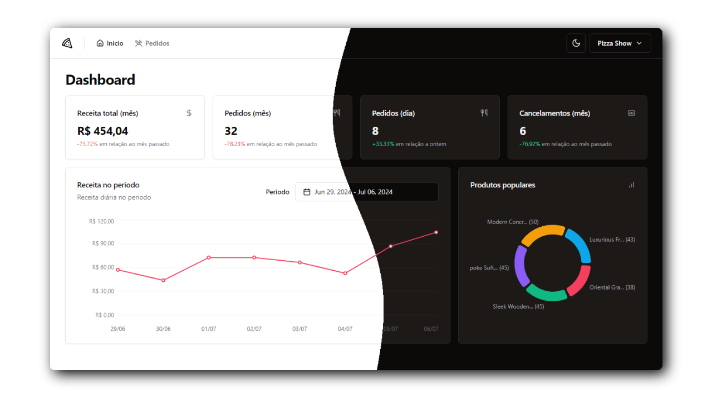

<h1 align="center">Pizza Shop</h1>

<div align="center">
    
    
    
    
</div>

<p align="center"></p>

## :page_with_curl: Description
A front-end application that allows you to control a restaurant's sales

## :game_die: Features
- [x] Authentication (Magic Link)
- [x] Metrics dashboard
- [x] View order list
- [x] Change order status
- [x] Change restaurant details

## :gear: Running
Make sure the [API](https://github.com/Gustavohps10/pizzashop-api) is running, you can run it using Docker

### Environment
You must create a copy of ```.env.local.example``` file and rename it to ```.env.local```

### Install the dependencies
```
yarn install
```

### Run the app
```
yarn dev
```

## :hammer_and_wrench: Tools
<p>
    
  
  
    
  
    
  
  
    
  
  
    
</p>

## :adult: Contributors

<!-- ALL-CONTRIBUTORS-LIST:START - Do not remove or modify this section -->
<!-- prettier-ignore-start -->
<!-- markdownlint-disable -->
<table>
  <tbody>
    <tr>
      <td align="center" valign="top" width="14.28%"><a href="https://gustavohenrique.vercel.app/"><br /><sub><b>Gustavo Henrique</b></sub></a><br /><a href="#code-Gustavohps10" title="Code">💻</a></td>
    </tr>
  </tbody>
</table>

<!-- markdownlint-restore -->
<!-- prettier-ignore-end -->

<!-- ALL-CONTRIBUTORS-LIST:END -->
